# Portfolio — 기술 문서

> **프로젝트**: 싱글 액션 RPG (Dark Souls / Elden Ring 스타일)  
> **엔진**: Unreal Engine 5.7.4  
> **규모**: C++ 소스 757파일, 20+ 독립 시스템  
> **개발**: 1인 개발 (설계, 구현, 디버깅 전체)  
> **주요 활용**: GAS · StateTree · EQS · Motion Matching · Motion Warping · Enhanced Input · MVVM · Subsystems · Control Rig · Animation Modifier

---

## 문서 개요

이 문서는 기능 목록보다 **전투 중심 액션 RPG를 유지보수 가능한 시스템으로 구성한 방식**을 설명합니다. 핵심은 공격/AI/히트/애니메이션을 각각 독립된 기능으로 끝내지 않고, DataAsset, GameplayTag, GAS, StateTree, AnimNotify가 같은 규칙 안에서 맞물리도록 설계한 점입니다.

### 핵심 어필 요약

| 포인트 | 어필 내용 | 본문 위치 |
|:---|:---|:---|
| Data-driven 전투 어빌리티 | 공격 타입 증가를 C++ 클래스 증가가 아니라 DataAsset + Feature 조합으로 처리 | 섹션 1 |
| StateTree 기반 몬스터 AI | 공격 선택, 실행 타이밍, 다수 몬스터 동시 공격 제한을 분리하고 Schema로 Task의 게임 의존을 끊음 | 섹션 2 |
| 전투 히트 파이프라인 | PostPhysics 스웹 트레이스부터 GE Component 리액션 라우팅까지 한 흐름으로 구성 | 섹션 3 |
| 애니메이션/워핑 동기화 | 플레이어 Motion Matching, 몬스터 AnimProxy, 전투 워핑을 역할별로 분리 | 섹션 4 |
| 제작 파이프라인 보조 시스템 | UI SourceRegistry, 입력 버퍼링, 에디터 커스터마이징, 레벨 전환 | 섹션 5 |

---

## 설계 철학

이 프로젝트를 만들면서 지키려 했던 원칙은 세 가지입니다.

**1. 기능 구현이 아닌 시스템 설계**  
"콤보 공격을 만든다"가 아니라, "새 공격을 추가할 때마다 C++ 클래스를 늘리지 않아도 되는 구조를 만든다"를 목표로 했습니다. 공격의 수치와 연출 차이는 가능한 범위에서 DataAsset과 Feature 조합으로 처리하고, C++은 실행 프레임워크를 담당하도록 분리했습니다.

**2. UE5 확장 포인트의 실전 활용**  
GameplayEffect Component, StateTree Schema, FInstancedStruct, MVVM FieldNotify 등 UE5가 제공하는 확장 포인트들을 실제 게임 문제를 해결하는 데 적용했습니다. 엔진을 수정하지 않고, 엔진이 열어둔 확장 인터페이스를 통해 필요한 것을 구현하는 방식입니다.

**3. 685파일 규모에서도 일관된 패턴 유지**  
프로젝트 규모가 커질수록 중요해지는 것은 개별 기능의 완성도뿐 아니라 전체 코드베이스의 일관성입니다. 네이밍 컨벤션, 에러 처리, 로깅, 메모리 관리가 주요 시스템에서 같은 패턴을 따르도록 관리했습니다.

---

## 1. 전투 어빌리티 프레임워크

### 1-1. 어빌리티 베이스 계층 설계

#### 해결하려는 문제

소울라이크 게임의 어빌리티는 종류가 매우 다양합니다. 점프, 앉기처럼 몽타주가 필요 없는 것, 사망이나 아이템 사용처럼 몽타주는 재생하지만 히트 판정은 없는 것, 콤보 공격처럼 모션 워핑과 히트 판정이 모두 필요한 것. 이들을 하나의 베이스 클래스에 몰아넣으면 불필요한 의존성이 생기고, 개별 클래스마다 따로 구현하면 코드가 중복됩니다.

#### 설계 결정

어빌리티 계층은 **"그 레벨에서만 필요한 책임"**을 기준으로 3단으로 분리했습니다.

- `PTGameplayAbility`: Feature 적용/해제, Cost/Cooldown, Cancel 태그 바인딩, GameplayEvent 래핑 등 모든 어빌리티 공통 인프라
- `PTMontageGameplayAbility`: 몽타주 재생/중단, Complete/Interrupt/Cancel 처리, 윈도우 태그 소유권 추적과 정리
- `PTCombatGameplayAbility`: 모션 워핑, 실시간 WarpTracking, 히트 판정, 페이즈 관리, HitStop 등 전투 실행 파이프라인

이 구조 덕분에 Guard처럼 몽타주가 필요 없는 어빌리티, Death/UseItem처럼 전투 판정이 필요 없는 몽타주 어빌리티, Attack/Execution/HitReaction처럼 전투 파이프라인이 필요한 어빌리티를 같은 기반 위에서 분리해 관리할 수 있습니다. 세부 클래스 배치와 예시는 아래 다이어그램에 정리했습니다.

> [첨부-A0] **클래스 다이어그램**: 위 3단 계층 구조를 시각화한 다이어그램. 각 계층에서 담당하는 핵심 메서드를 표시합니다.

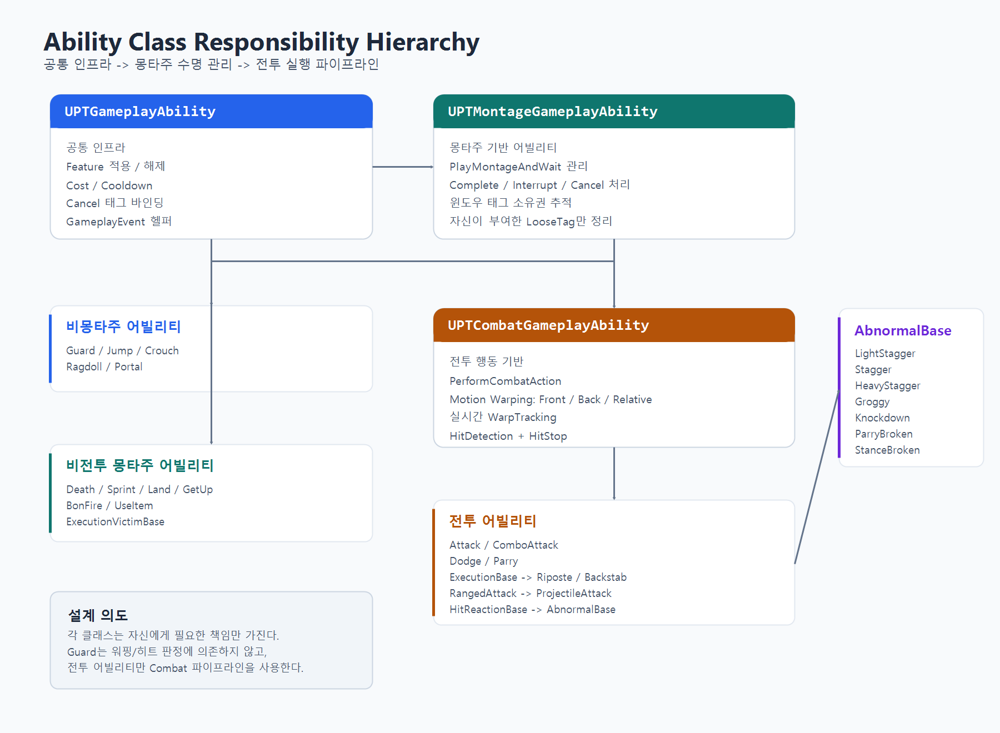

#### Attack vs ComboAttack — 같은 뿌리, 다른 실행 모델

둘 다 `CombatGameplayAbility`를 상속하지만, 실행 모델이 다릅니다.

| | Attack | ComboAttack |
|:---|:---|:---|
| 입력 | 단일 실행 | Light/Heavy 분기 버퍼링 |
| 데이터 | `UPTAbilityActionAsset` 1개 | `TMap<InputTag, UPTComboAbilityActionAsset>` 링크드 리스트 |
| 용도 | 몬스터 개별 공격, 특수 공격 | 플레이어 콤보, 몬스터 연속 공격 |
| 주요 로직 | ActivateAbility → PerformCombatAction → 끝 | 입력 버퍼 → Branch 이벤트 → ExecuteNextCombo → 반복 |

Attack은 **"한 번 실행하고 끝나는 전투 행동"**이고, ComboAttack은 **"입력에 따라 분기하며 이어지는 전투 행동"**입니다. 공통 전투 인프라(워핑, 히트 판정, 페이즈)는 CombatGameplayAbility에서 공유하고, 실행 흐름만 다릅니다.

전투 외 동작도 같은 3단 계층 위에서 처리됩니다. 점프/착지/앉기/기상/사망/래그돌/화톳불 상호작용 같은 생명주기성 행동도 모두 어빌리티(`Jump`, `Land`, `Crouch`, `GetUp`, `Death`, `Ragdoll`, `BonFire` 등)로 정의되어 있어, 캐릭터의 모든 상태 전이가 어빌리티 활성화/종료 라이프사이클을 따릅니다. 전투/비전투 가릴 것 없이 윈도우 태그 정리, 몽타주 인터럽트 처리, 입력 컨텍스트 전환이 한 프레임워크 안에서 일관되게 동작합니다.

---

### 1-2. AbilityFeature 컴포지션

#### 해결하려는 문제

소울라이크 전투는 공격 타입이 수십 종입니다. 라이트 어택, 헤비 어택, 각 무기별 콤보, 돌진 공격, 점프 공격, 가드 카운터... GAS(Gameplay Ability System)의 기본 패턴을 따르면, 공격 타입 하나마다 Ability 클래스가 하나씩 필요합니다.

```
Attack_SwordLight, Attack_SwordHeavy, Attack_AxeLight, Attack_AxeHeavy,
Attack_SwordCombo1, Attack_SwordCombo2, Attack_SwordCombo3...
```

클래스가 늘어날수록 유지보수 부담이 커집니다. 그런데 이 공격들을 들여다보면, 실제로 다른 것은 "데미지 배율", "스태미나 비용", "히트 리액션 종류", "모션 워핑 거리" 같은 **파라미터**이지, 로직 자체가 다른 게 아닙니다.

#### 선택지 비교

| 접근법 | 장점 | 단점 |
|:---|:---|:---|
| Ability 상속 분화 | 단순, 직관적 | 클래스 O(N) 증가, 중복 코드 |
| Blueprint 서브클래싱 | 디자이너 접근성 | 디버깅 어려움, 성능 오버헤드 |
| **FInstancedStruct 기반 Feature 컴포지션** | 클래스 O(1), 데이터 드리븐 | InstancedStruct 런타임 비용 |

#### 설계 결정

세 번째 방식을 선택했습니다. 핵심 아이디어는 **"어빌리티는 실행 프레임워크만 담당하고, 전투 행동은 Feature 조합으로 결정한다"**입니다.

`FPTAbilityFeature`를 기반 구조체로 두고, 이를 상속한 구체 Feature 18종을 만들었습니다(StaminaCost·HitProfile은 각각 Single/Multi로 분기). 각 Feature는 하나의 전투 행동 속성을 캡슐화합니다.

```
[AbilityActionData]
 ├─ MontageData (재생할 애니메이션)
 └─ Features[] (FInstancedStruct 배열)
     ├─ FPTAbilityFeature_Damage          — 데미지 배율
     ├─ FPTAbilityFeature_StaminaCost     — 스태미나 소비
     ├─ FPTAbilityFeature_HitReaction     — 피격 리액션 종류 (스태거/넉다운/...)
     ├─ FPTAbilityFeature_StanceDamage    — 체간 데미지
     ├─ FPTAbilityFeature_MotionWarping   — 워핑 거리/앵커 타입
     ├─ FPTAbilityFeature_MultiHitProfile — 페이즈별 히트 데이터
     ├─ FPTAbilityFeature_Cooldown        — 쿨다운
     └─ ... (17종+)
```

하나의 `ComboAttack` 어빌리티 클래스가 있고, 이 클래스는 DataAsset에서 Feature 배열을 읽어서 실행합니다. 새로운 공격을 추가할 때는 DataAsset을 하나 만들고 Feature를 조합하기만 하면 됩니다.

> [첨부-A1] **에디터 스크린샷**: ComboAbilityActionAsset의 디테일 패널. Feature 배열에 Damage, StaminaCost, HitProfile이 조합된 모습. "코드 0줄 추가"로 새 공격을 만드는 과정이 이 화면 하나에 담깁니다.

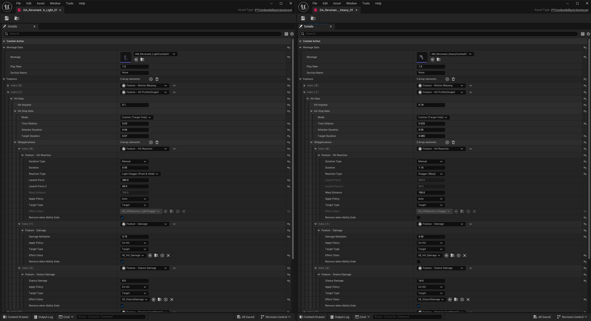

#### Feature 적용 정책

GameplayEffect를 적용하는 Feature는 `ApplyPolicy`를 가집니다. 4종이 비트 플래그로 조합 가능합니다.

| 정책 | 시점 | 용도 |
|:---|:---|:---|
| `Auto` | 어빌리티 활성화/종료 자동 시점 | 스태미나 선불, 어빌리티 종료 시 정리되는 버프 |
| `Manual` | 어빌리티 코드에서 명시적으로 호출 | 특수 페이즈 등 임의 타이밍에 적용해야 하는 효과 |
| `OnHit` | 히트 판정 성공 시 | 데미지, 히트 리액션 |
| `OnBlockedHit` | 가드에 막힌 경우 | 가드 임팩트, 스태미나 데미지 |

같은 공격이라도 "가드에 막혔을 때"와 "직접 맞았을 때"의 반응이 다릅니다. 이것을 별도 코드가 아니라, 하나의 Feature에 ApplyPolicy만 다르게 설정해서 처리합니다.

#### 페이즈별 스태미나 비용 — Feature의 실전 활용 예시

Feature 시스템의 유연성을 보여주는 대표적 사례가 `StaminaCost`입니다. 단순히 "공격 1회 = 스태미나 20" 방식이 아니라, **Single과 Multi 두 종류**로 분리했습니다.

| 타입 | 구조 | 용도 |
|:---|:---|:---|
| **SingleStaminaCost** | 고정값 1개 | 단타 공격, 닷지 |
| **MultiStaminaCost** | `TMap<PhaseTag, float>` | 콤보 (1타: 15, 2타: 18, 3타: 25) |

Multi의 핵심은 `CommitPolicy`입니다. `OnAbilityCommit`(어빌리티 시작 시 전액 선불)이 아니라 `OnGameplayEvent`(애니메이션 Notify가 발생할 때 해당 페이즈 비용만 후불)로 설정하면, 콤보 각 페이즈의 비용 커밋 시점을 애니메이션 타이밍에 맞출 수 있습니다.

현재 구현은 콤보 진입 시 "현재 스태미나가 양수인지"를 확인하고, 실제 비용은 Notify 시점에 커밋합니다. 부족분을 즉시 차단하기보다 스태미나 빚을 허용하는 방식이므로, 핵심은 "부족하면 끊김"이 아니라 **페이즈별 비용과 커밋 시점을 데이터로 분리한 것**입니다.

#### 콤보 시스템과의 연동

콤보는 **링크드 리스트 패턴**의 DataAsset으로 구현했습니다.

```
[Combo Step 1] ─Light→ [Combo Step 2-L] ─Light→ [Combo Step 3-LL]
               ─Heavy→ [Combo Step 2-H] ─Heavy→ [Combo Step 3-HH]
```

각 노드가 `ComboAbilityActionAsset`이고, 자체 Feature 배열을 가집니다. 콤보 1타와 3타의 데미지, 스태미나 비용, 히트 리액션이 전부 다를 수 있고, 이 차이는 코드가 아니라 데이터에서 결정됩니다.

인풋 버퍼링도 통합되어 있습니다. 플레이어가 콤보 윈도우 중에 입력하면 버퍼에 저장되고, Branch 이벤트가 발생하면 버퍼된 입력에 따라 다음 콤보 노드로 분기합니다.

> [첨부-A2] **에디터 스크린샷**: ComboAbilityActionAsset의 링크드 리스트 구조. NextLightAttack / NextHeavyAttack 참조가 보이고, 각 노드마다 다른 Feature 세팅이 적용된 모습.

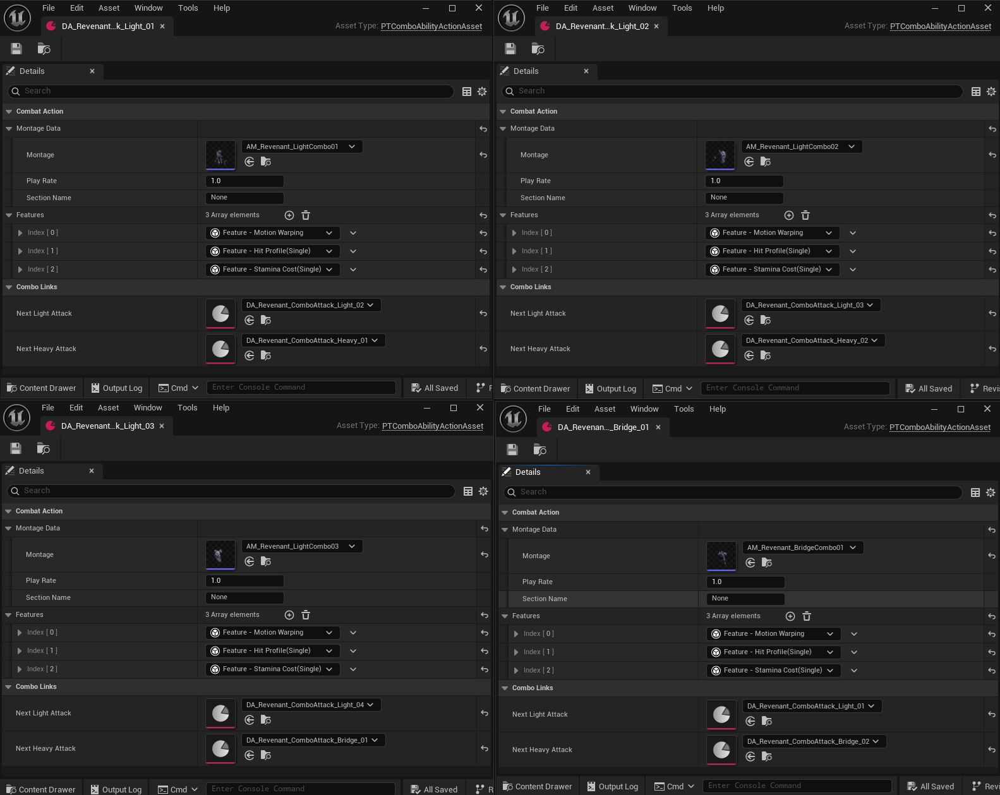

> [첨부-A3] **플레이 영상**: 실제 콤보 실행 장면. 약공 4타, 강공 3타, 약공 3타 → 브릿지 콤보 3타, 약/강 혼합 콤보를 순서대로 보여주고, 화면 오버레이로 입력 시퀀스와 버퍼/실행 타이밍을 함께 표시합니다.

[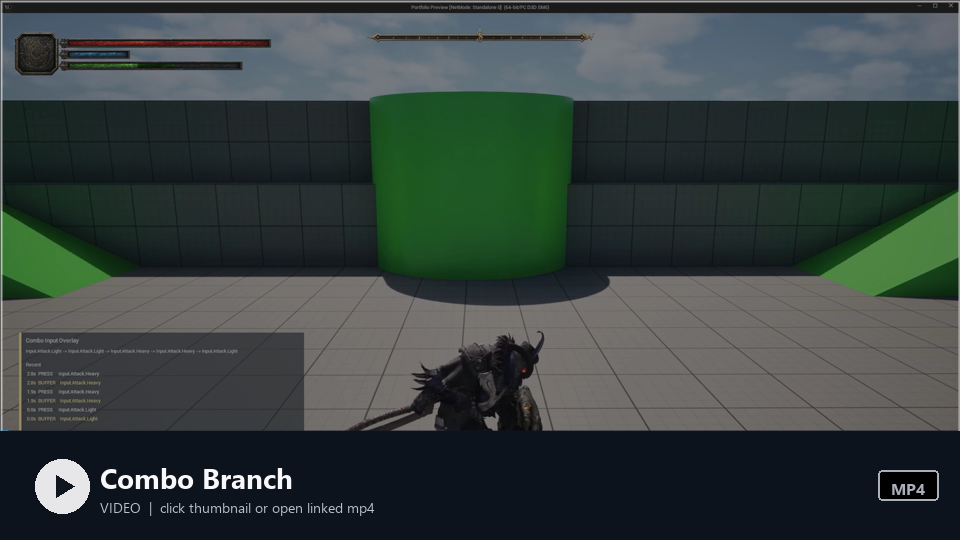](https://youtu.be/tqJmdTBIvQY)

**▶ 영상 보기:** [콤보 분기 MP4 열기](https://youtu.be/tqJmdTBIvQY)

#### 플레이어와 몬스터의 어빌리티 공유

이 구조에서 한 가지 더 설명할 부분은, **플레이어와 몬스터가 같은 어빌리티 클래스를 사용한다**는 점입니다.

Dodge, Guard, Parry, Attack, ComboAttack, HitReaction 등 핵심 전투 어빌리티에는 `if (IsPlayer)` / `if (IsMonster)` 같은 분기를 두지 않았습니다. 어빌리티는 "누가 실행하는지"가 아니라 전달된 데이터와 태그를 기준으로 동작합니다.

차이를 만드는 것은 **데이터 계층**입니다:

| 결정 요소 | 플레이어 | 몬스터 |
|:---|:---|:---|
| 어빌리티 부여 | 플레이어용 AbilitySet DataAsset | 몬스터용 AbilitySet DataAsset |
| 실행 트리거 | Enhanced Input → GameplayEvent 발행 | AI StateTree → `TryActivateAbilityWithEvent` |
| 행동 파라미터 | 플레이어용 ActionData (몽타주, 데미지, 워핑) | 몬스터용 ActionData |

`AbilitySet`은 실행 키(`TriggerTag`), 실행 중 식별자(`IdentityTag`), Ability 클래스를 함께 부여하는 DataAsset입니다. 플레이어는 `Input.Attack_Light` 같은 입력 태그를 실행 키로 사용하고, 몬스터는 AIConfig의 `AbilityTag`와 맞춘 `Ability.ID.Slash`, `Ability.ID.DoubleSlash` 같은 어빌리티 ID 태그를 실행 키로 사용합니다. 즉 플레이어와 몬스터가 같은 AbilitySet 구조와 Ability 클래스를 공유하더라도, 입력/AIConfig/ActionData 조합에 따라 서로 다른 전투 행동이 실행됩니다.

이 구조의 실질적 이점은 **유지보수 비용**입니다. 예를 들어 공격 판정, 데미지 적용, 가드 피격 처리, 처형 이벤트 흐름처럼 양쪽이 공유하는 전투 규칙을 Ability 계층에서 개선하면 플레이어와 몬스터 모두 같은 규칙을 사용합니다. 캐릭터별 차이는 데이터와 태그 조합으로 분리하고, 핵심 전투 로직은 한 곳에서 관리합니다.

#### 실제 효과

- 어빌리티 베이스 3단 분리로 각 계층의 헤더 API 책임을 명확히 분리
- Attack/ComboAttack이 전투 인프라를 공유하면서도 실행 모델은 독립
- 플레이어/몬스터 공통 어빌리티 → **전투 규칙이 한 곳에만 존재**, 양쪽 일관성 유지에 유리
- 공격 타입별 Ability 클래스 증식을 방지 — 새 공격은 대부분 DataAsset/Feature 조합으로 추가 가능
- 밸런싱 수치를 에디터에서 즉시 조정 가능

---

### 1-3. LooseTag 소스 추적 — 윈도우 태그의 정확한 수명 관리

#### 해결하려는 문제

소울라이크 전투에서는 애니메이션 타이밍에 따라 "지금 콤보 가능", "지금 캔슬 가능", "지금 무적" 같은 상태 윈도우가 열리고 닫힙니다. GAS에서 이를 구현하는 일반적인 방법은 AnimNotify가 LooseGameplayTag를 부여/제거하는 것입니다.

그런데 **두 개의 Notify가 같은 태그를 동시에 부여하면** 문제가 발생합니다. NotifyA가 `Window::Cancel` 태그를 부여하고, 이어서 NotifyB도 같은 태그를 부여합니다. NotifyA가 먼저 끝나서 태그를 Remove하면, NotifyB가 아직 유효한데도 태그가 사라집니다.

단순한 레퍼런스 카운팅으로 해결할 수 있다고 생각할 수 있지만, 어빌리티가 비정상 종료(캔슬, 인터럽트)될 때 **"내가 부여한 태그만 정확히 정리"**하려면, 누가 몇 개를 부여했는지 추적해야 합니다.

#### 설계 결정

`PTAbilitySystemComponent`에 **이중 맵 구조**로 소스를 추적합니다:

```
TMap<FGameplayTag, TMap<TWeakObjectPtr<const UObject>, int32>>
//    ↑ 태그             ↑ 어떤 소스(몽타주)가       ↑ 몇 번 부여했는가
```

AnimNotify가 태그를 부여할 때, 자신이 속한 애니메이션 시퀀스를 소스로 등록합니다. 이렇게 하면:

- NotifyA(MontageSword)가 `Cancel` 1회 부여 → `{Cancel: {MontageSword: 1}}`
- NotifyB(MontageShield)가 `Cancel` 1회 부여 → `{Cancel: {MontageSword: 1, MontageShield: 1}}`
- MontageSword 종료 → MontageSword 소스만 정리 → `{Cancel: {MontageShield: 1}}` — MontageShield의 태그는 유지

#### 캔슬 윈도우 소유권 검증

이 추적 시스템 위에 `MontageGameplayAbility`의 `CanConsumeAllowTag()`가 동작합니다:

```
"이 캔슬 윈도우 태그가, 지금 내가 재생 중인 몽타주에 의해 부여된 것인가?"
```

다른 어빌리티의 몽타주가 부여한 캔슬 윈도우를 가로채서 사용하는 것을 방지합니다. 어빌리티 종료 시에는 `CleanupOwnedWindowTags()`가 자신의 몽타주가 부여한 태그만 정확히 제거합니다.

#### 이 구조가 필요해진 배경

어빌리티가 한두 종일 때는 이 문제가 드러나지 않습니다. 콤보, 닷지, 가드, 패링이 동시에 활성화되고, 캔슬과 인터럽트가 빈번해지면서 "가끔 캔슬이 안 되는" 재현하기 어려운 버그가 발생했고, 원인을 추적해보니 태그 수명 관리가 근본 원인이었습니다. 개별 케이스마다 대응하는 대신, 소스 추적이라는 구조적 해결을 선택했습니다.

---

## 2. 몬스터 AI — StateTree + TriggerDecision

### 해결하려는 문제

소울라이크 게임의 AI에서 신경 쓴 부분은 세 가지입니다:

1. **읽기**: 플레이어의 상태(스턴, 가드, 회피 중)를 인식하고 적절히 대응
2. **커밋먼트**: 공격을 결심하면 중간에 취소하지 않는 "무게감"
3. **페어플레이**: 다수 몬스터가 동시에 공격하지 않는 "암묵적 규칙"

### 선택지 비교

| 접근법 | 장점 | 단점 |
|:---|:---|:---|
| BehaviorTree 조건 분기 | UE 기본 지원, 직관적 | 표현력 한계, 유틸리티 점수 어려움 |
| 풀 Utility AI | 유연한 점수 기반 | 디버깅 난이도 높음, 예측 불가 |
| **StateTree + 커스텀 TriggerDecision** | 구조화된 유틸리티, 디버깅 가능 | 커스텀 컴포넌트 개발 비용 |

### 설계 결정

"무엇을 할지(SelectAbility)"와 "언제 실행할지(TriggerDecision)"를 **분리**했습니다.

#### 2-1. SelectAbility — "무엇을 할지"

모든 몬스터 어빌리티에 BaseScore가 있고, 여기에 ScoreModifier들이 곱해져서 최종 점수가 결정됩니다.

```
최종 점수 = BaseScore × DistanceModifier × TargetTagModifier × NoiseModifier × ...
```

ScoreModifier는 4종을 구현했습니다:

| 모디파이어 | 역할 |
|:---|:---|
| `Distance` | 사거리 안이면 1.0, 밖이면 거리 비례 감쇄 |
| `TargetTag` | 타겟이 특정 상태일 때 점수 배율 (스턴 시 잡기 부스트) |
| `OwnerTag` | 자신이 특정 상태일 때 점수 배율 |
| `Noise` | 0.9~1.1 랜덤 변동 → 반복 패턴 완화 |

**Immediate/Desired 이중 점수 체계**: 즉시 실행 가능한 어빌리티(ImmediateScore)를 우선하되, 실행 불가하지만 하고 싶은 어빌리티(DesiredScore)도 추적합니다. 사거리 밖일 때 접근하면서 원하는 공격을 준비하는 행동이 이 구조에서 자연스럽게 나옵니다.

각 ScoreModifier는 `ApplicationMode`(`ImmediateOnly` / `ImmediateAndDesired`)를 갖습니다. Distance처럼 "사거리 안에 있을 때만 의미 있는" 모디파이어는 `ImmediateOnly`로 설정해 Desired 점수에는 영향을 주지 않도록 하고, OwnerTag처럼 "어떤 상황에서든 이 행동을 더/덜 원하게 하는" 모디파이어는 `ImmediateAndDesired`로 둡니다. 같은 ScoreModifier 클래스를 어빌리티별로 다르게 쓸 수 있어, 의도 표현이 코드 수정 없이 데이터에서 해결됩니다.

> [첨부-B1] **에디터 스크린샷**: PTAIConfig 에셋의 Abilities 배열. 각 어빌리티에 BaseScore, AttackRange, ScoreModifiers가 설정된 디테일 패널.

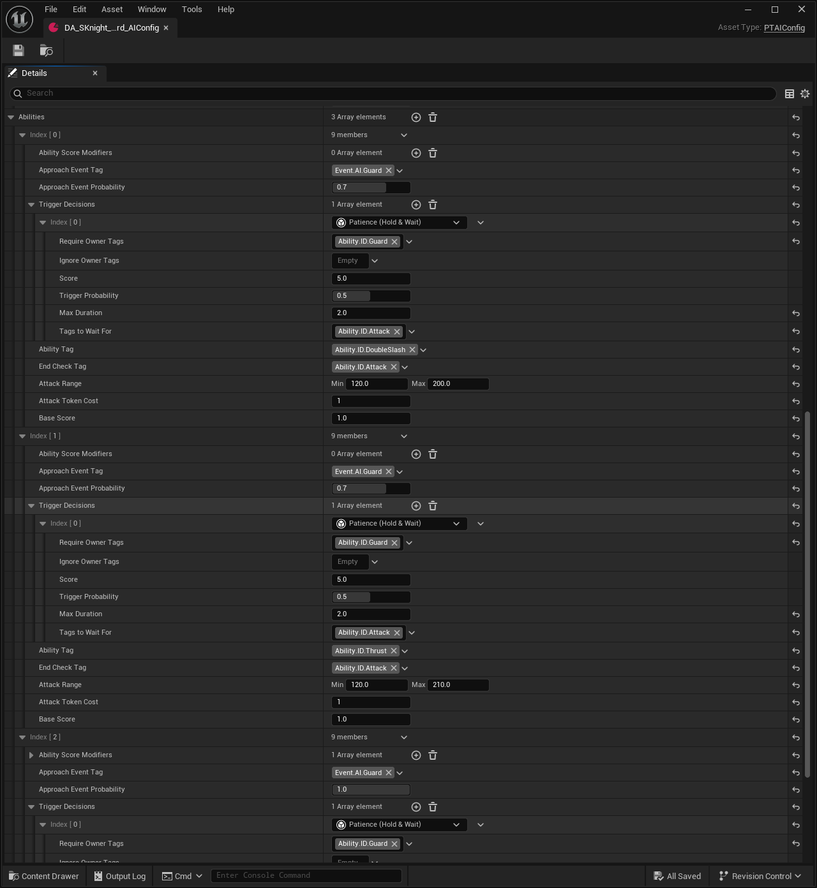

#### 2-2. TriggerDecision — "언제 실행할지"

어빌리티가 선택된 후, 바로 실행하지 않습니다. TriggerDecision이 "지금 실행해도 되는가"를 매 틱 평가합니다.

| Decision 타입 | 동작 | 실제 게임 효과 |
|:---|:---|:---|
| **Commit** | 즉시 실행 | 단순 공격 |
| **Hesitate** | 확률 기반 딜레이(기본 0.5~1.0초, 데이터로 조정) 후 실행 | "생각하는 듯한" 자연스러운 AI |
| **Patience** | 타겟/소유자 조건이 유지되는 동안 최대 시간까지 대기 | 불리한 타이밍을 넘긴 뒤 실행 |
| **Abort** | 타겟이 무적/패링 상태면 공격 취소 | 불합리한 공격 방지 |

이 4종이 점수 경쟁을 하고, 매 틱 가장 높은 점수의 Decision이 실행 여부를 결정합니다. 상황이 바뀌면 Decision도 바뀝니다. 매 틱 `CalculateScore`로 각 Decision의 점수를 산출하고, 최고점 Decision의 `OnEnter`/`OnTick`을 실행합니다. Abort가 10, Patience가 5, Hesitate와 Commit이 1처럼 우선순위를 데이터에 박아두면, "무적/패링이면 즉시 취소 → 그게 아니면 잠깐 대기 → 둘 다 아니면 그냥 실행" 같은 분기를 if 문 없이 점수만으로 표현할 수 있습니다.

**예시 — 잡기 공격 설정:**
```
Decision 1: Abort (점수 10.0) — 타겟이 무적이면 공격 취소
Decision 2: Patience (점수 5.0) — 설정된 대기 태그가 유지되는 동안 최대 2초 대기
Decision 3: Commit (점수 1.0) — 위 조건 모두 불발 시 그냥 실행
```

Patience가 이기면 몬스터는 설정된 태그가 사라지거나 최대 대기 시간이 끝날 때까지 보류하고, 그 뒤 실행으로 넘어갑니다. 즉 "특정 상태가 될 때까지"가 아니라, **불리하거나 연출상 기다릴 상태가 해소될 때까지** 대기하는 구조입니다. 이 모든 설정이 데이터입니다.

> [첨부-B2] **에디터 스크린샷**: TriggerAbilityDecision 배열 비교 화면. 왼쪽은 검방 AIConfig의 Patience 설정, 오른쪽은 양손대거 AIConfig의 Hesitate 설정으로, 같은 판단 파이프라인에서 몬스터별 전투 성향을 데이터로 분리한 예시입니다.
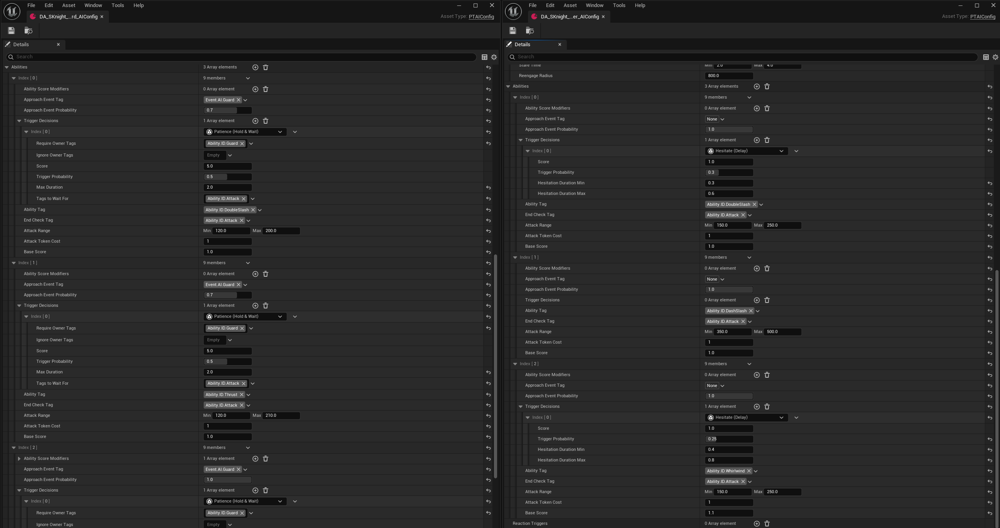

#### 2-3. AttackToken — "페어플레이"

다수 몬스터가 동시에 플레이어를 공격하면 회피할 수 없는 상황이 만들어집니다.

`PTAttackTokenSubsystem`이 타겟당 토큰 풀을 관리합니다. 몬스터는 공격 전에 토큰을 요청하고, 풀이 비어 있으면 공격을 보류합니다. 공격이 끝나면 토큰을 반환합니다.

```
[토큰 풀: 3개]
몬스터 A: 토큰 획득 → 공격 중
몬스터 B: 토큰 획득 → 공격 중  
몬스터 C: 토큰 획득 → 공격 중
몬스터 D: 토큰 부족 → 대기 (Backoff 이동)
```

토큰이 없는 몬스터들은 Orbit(측면 이동)이나 Backoff(후퇴)로 자연스럽게 주변을 맴돕니다.

타겟별 풀과 보유자 맵을 모두 `TWeakObjectPtr` 기반으로 보관하고, 주기적으로 무효 참조를 제거합니다. 타겟이나 요청자가 소멸된 뒤에도 풀이 누적되지 않도록 한 부분으로, 다수 몬스터 전투에서 토큰이 회수되지 않는 잠재 결함을 막기 위한 처리입니다. PressureSlot도 동일한 정리 메커니즘을 따릅니다.

> [첨부-B4] **디버그 영상**: DrawDebugAttackToken CVar 활성화 상태. 토큰을 가진 몬스터와 대기 중인 몬스터가 시간에 따라 바뀌는 장면.

[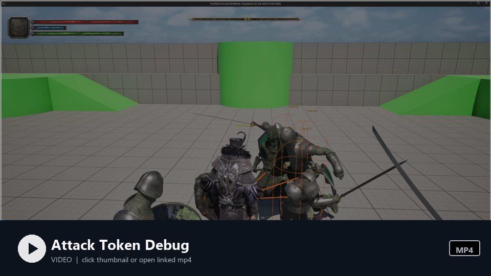](https://youtu.be/AJkKwTYVhSk)

**▶ 영상 보기:** [공격 토큰 디버그 MP4 열기](https://youtu.be/AJkKwTYVhSk)

#### 2-4. PressureSlot — 위치 겹침 방지

EQS(Environment Query System)를 활용해 타겟 주변에 "압력 슬롯"을 배치합니다. 몬스터는 빈 슬롯을 예약하고 그 위치로 이동합니다. 여러 몬스터가 같은 자리에 뭉치지 않습니다.

> [첨부-B6] **디버그 영상**: DrawDebugPressureSlot CVar 활성화. 타겟 주변 도넛 형태의 슬롯 예약과 몬스터 포지셔닝이 시간에 따라 갱신되는 장면.

[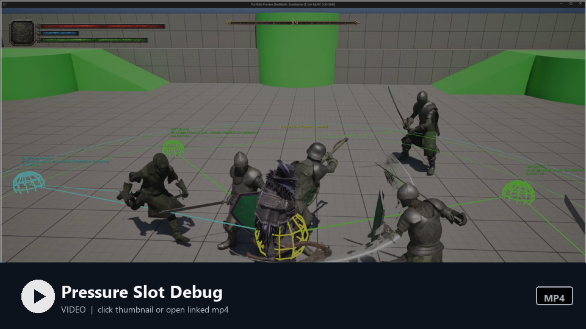](https://youtu.be/9kENILrwqmk)

**▶ 영상 보기:** [압박 슬롯 디버그 MP4 열기](https://youtu.be/9kENILrwqmk)

#### 2-5. StateTree Schema — Task에서 게임 의존을 끊는 확장 포인트

위 시스템들이 깔끔하게 분리될 수 있었던 배경에는 `UPTStateTreeAISchema`가 있습니다. 일반적인 StateTree Task는 몬스터/컨트롤러 클래스를 직접 캐스팅해 필요한 데이터를 꺼내 쓰는 경우가 많은데, 그렇게 하면 Task가 게임 객체 계층에 강결합되어 재사용이 어렵습니다.

Schema 단에서 6종의 Context — `AIConfig`, `AbilitySystemComponent`, `AIProxyContext`, `AIMoveAgentContext`, `AIPerceptionContext`, `AICombatContext` — 를 외부 데이터로 선언하고, `SetContextData()`에서 `IPTAIInterface`, `IAbilitySystemInterface`, `IPTAIContextProvider`를 통해 인터페이스 기반으로 주입했습니다. Task는 이름으로 Context를 가져오기만 하면 되고, 몬스터 클래스가 어떻게 생겼는지는 알 필요가 없습니다. 새로운 Context가 필요하면 Schema에 한 줄 추가하고 인터페이스를 구현하면 끝이라, 위에서 다룬 SelectAbility/TriggerAbility/AttackToken/PressureSlot 같은 Task들을 독립적으로 확장할 수 있었습니다.

### 실제 효과

- 공격 선택/실행 로직은 몬스터 클래스가 아니라 StateTree Task와 DataAsset에 집중
- 새로운 몬스터 타입: AIConfig DataAsset 조합으로 서로 다른 행동 패턴 구성
- Hesitate, Patience, Token 조합으로 전투 리듬에 변화를 줌
- Schema가 인터페이스 기반으로 Context를 주입 → Task가 몬스터 구체 클래스에 의존하지 않음

---

## 3. 전투 히트 파이프라인 — 트레이스에서 리액션까지

### 해결하려는 문제

소울라이크 전투의 "타격감"은 여러 시스템이 정확히 맞물려야 만들어집니다. 히트 판정이 틀리면 불공정하고, 피드백이 늦으면 답답하고, 리액션이 단조로우면 지루합니다.

이 프로젝트에서는 **히트 판정 → 데미지 계산 → 히트 리액션 결정 → 이상상태 라우팅 → VFX/SFX 피드백**을 하나의 파이프라인으로 설계했습니다.

### 3-1. 전투 트레이스 — "언제 맞았는가"

UE 기본 무기 트레이스 대신, `PTAttackTraceComponent`를 자체 구현했습니다.

**이유**: 빠른 무기 스윙에서 프레임 사이에 충돌이 누락되는 문제. UE 기본 트레이스는 현재 프레임의 위치만 검사하지만, 실제 무기는 프레임 사이에 긴 호(arc)를 그립니다.

**해결**: PostPhysics 틱에서 **이전 프레임 위치 → 현재 프레임 위치** 사이를 보간하며 연속 스웹 트레이스를 수행합니다. 스텝 수는 이동 거리에 따라 자동 계산됩니다.

```
StepDensity = MinExtent × 2.5
Steps = Clamp(Distance / StepDensity, 1, MaxSteps)
```

**이중 히트 판정**: 메시 충돌과 셰이프 충돌을 동시에 검사합니다. 메시 히트가 있으면 우선 채택하고, 없으면 셰이프 히트를 1프레임 보류(pending) 후 확정합니다. 이렇게 하면 정확한 표면 정보(물리 머티리얼)를 얻으면서도 히트 누락을 방지합니다.

> [첨부-C1] **디버그 비교 영상**: DrawDebugCollision CVar 활성화. 서브스텝핑 적용 전/후를 각각 촬영해, 빠른 무기 스윙에서 프레임 사이 충돌 누락이 어떻게 줄어드는지 비교합니다.

[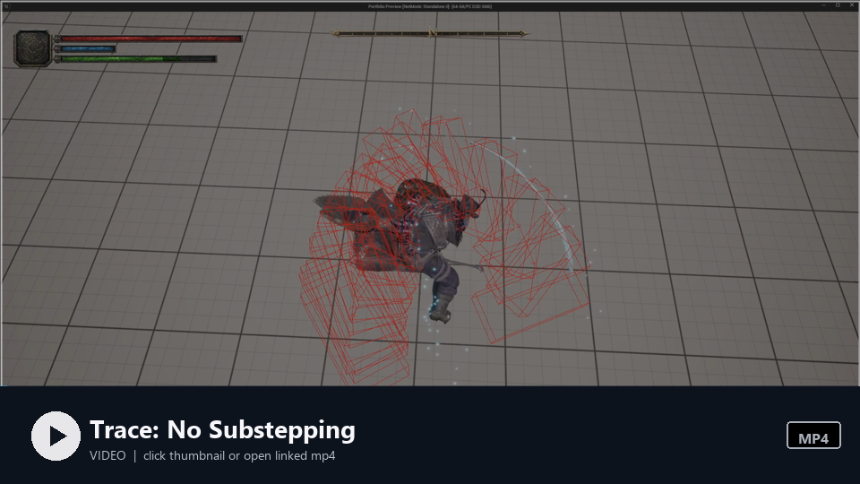](https://youtu.be/MxxXo6uji84)

**▶ 영상 보기:** [서브스텝핑 미적용 MP4 열기](https://youtu.be/MxxXo6uji84)

[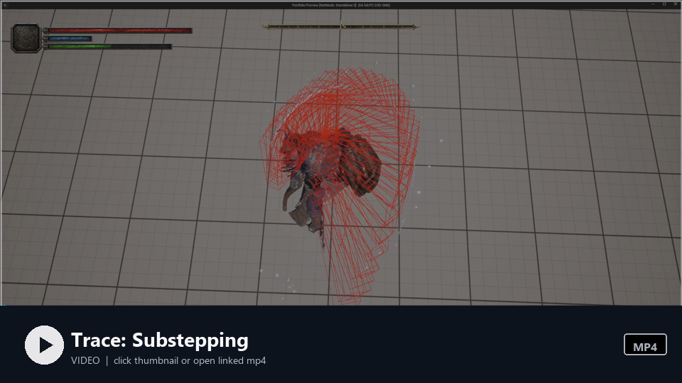](https://youtu.be/UTj3jl0GURY)

**▶ 영상 보기:** [서브스텝핑 적용 MP4 열기](https://youtu.be/UTj3jl0GURY)

> [첨부-C2] **에디터 스크린샷**: WeaponAttackTraceDefinition 설정 화면. 무기 블루프린트에서 SocketNameNear/Far, ShapeType, BoxExtent/Rotation, DrawDebugShape를 데이터로 조정하는 구조를 보여줍니다.
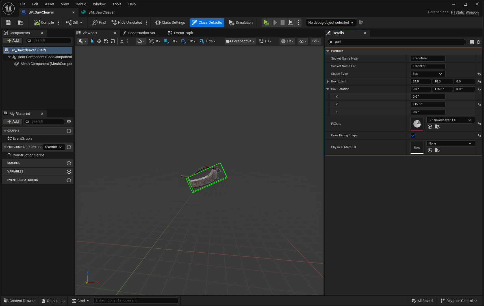

### 3-2. 데미지 계산 — "얼마나 아픈가"

커스텀 `UPTDamageCalculation`(GameplayEffect Execution Calculation)으로 처리합니다.

```
DefenseRate = AttackPower / (AttackPower + DefensePower)
FinalDamage = BaseDamage × DamageMultiplier × DefenseRate × OutgoingMultiplier
```

**왜 이 공식인가**: 단순 빼기(`Attack - Defense`)는 방어력이 높아지면 데미지가 0이 되고, 단순 나누기(`Attack / Defense`)는 방어력이 낮을 때 데미지가 폭증합니다. 비율 공식은 방어력이 높을수록 효과가 줄어들되, 데미지가 쉽게 0으로 떨어지지 않습니다. 다크소울 시리즈가 사용하는 방식과 유사합니다.

추가로 **화염 축적(Fire Buildup)** 시스템이 이 계산에 통합되어 있습니다. 히트마다 화염 축적량이 쌓이고, 최대치를 넘으면 화상 상태가 발동합니다. 히트가 멈추면 축적은 시간이 지나면서 자연 감쇄되는데, 이 감쇄 제어를 별도 타이머 코드 없이 **GE Stacking:Refresh 정책**만으로 해결했습니다. 히트마다 `BlockFireBuildupDecay` 이펙트를 Refresh 정책으로 적용하면, 히트가 이어지는 동안 감쇄가 멈추고, 히트가 끊기면 이펙트가 만료되면서 감쇄가 자동 재개됩니다.

> [첨부-C10] **플레이 영상**: 무기 화염 버프 상태에서 FireBuildup 수치가 상승하고, 일정 시간 대기 후 감쇄되는 흐름을 Attribute 디버그로 확인합니다. 이후 다시 공격해 축적치를 임계값까지 올리면 Burning 상태와 화상 이펙트가 발동됩니다. 수치 변화를 쉽게 볼 수 있도록 FireBuildup Attribute 영역을 확대 인셋으로 강조했습니다.

[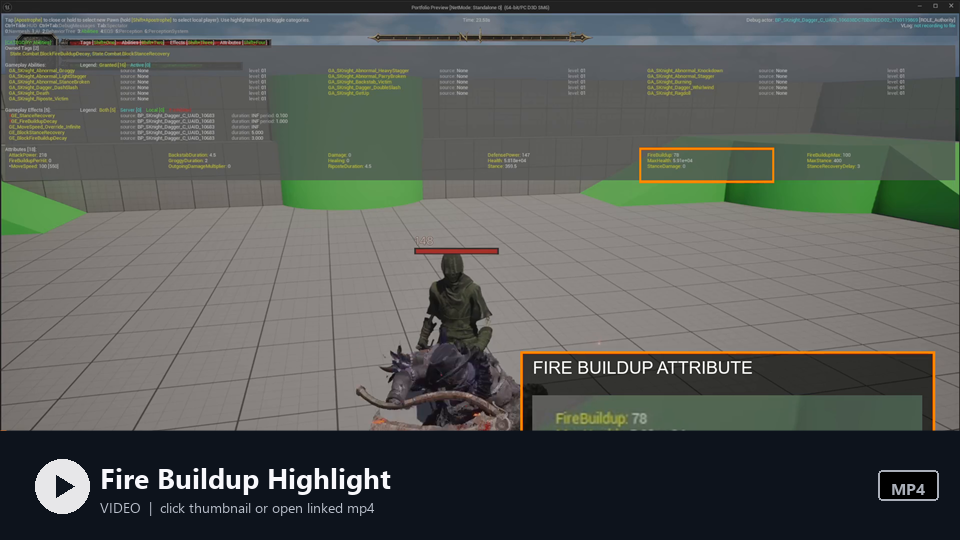](https://youtu.be/ba6KJMf7psQ)

**▶ 영상 보기:** [FireBuildup 발화 하이라이트 MP4 열기](https://youtu.be/ba6KJMf7psQ)

### 3-3. 히트 리액션 라우팅 — "어떻게 반응하는가"

히트 리액션 이벤트 발행은 `UPTGameplayEffectComponent_HitReaction`이라는 **커스텀 GE Component**가 담당합니다. 패링/무적처럼 GE 적용 전에 결정되어야 하는 케이스는 히트 적용 단계에서 먼저 처리하고, GE Component는 적용된 EffectContext를 바탕으로 가드/직격 리액션을 라우팅합니다.

```
[히트 발생]
  → ApplyAbilityHitCore
    ├─ 무적/패링 여부는 GE 적용 전에 처리
    └─ 가드/직격 여부를 EffectContext에 기록
      → GameplayEffect 적용
        → GE Component가 EffectContext를 보고 라우팅:
          ├─ 가드 성공 → GuardImpact (Weak/Strong/Broken)
          └─ 직격 → HitReaction 타입에 따라:
              ├─ LightStagger  → 밀림 + 짧은 경직
              ├─ Stagger       → 워프 + 경직 몽타주
              ├─ HeavyStagger  → 큰 워프 + 긴 경직
              ├─ Knockdown     → 넘어짐 + 기상 페이즈
              └─ StanceBroken  → 체간 파괴 → 처형 기회
```

이 라우팅이 GE Component 안에서 일어나기 때문에, 어빌리티 코드에서는 리액션 분기를 다루지 않습니다. Feature에 HitReaction 타입만 설정하면, 나머지는 파이프라인이 처리합니다.

### 3-4. 방향성 리액션

피격 리액션은 **방향**을 고려합니다. 공격자의 상대 각도를 계산해서 전/후/좌/우 중 적절한 몽타주를 선택합니다. 앞에서 맞으면 뒤로 밀리고, 왼쪽에서 맞으면 오른쪽으로 밀립니다.

```cpp
FGameplayTag DirectionTag = CalculateDirectionTag(AttackerLocation, VictimRotation);
// → PTTag::HitDirection::Front / Back / Left / Right
```

> [첨부-C3] **플레이 영상**: 몬스터의 전/후/좌/우 위치에서 시간차를 두고 Stagger(강공격 피격 리액션)를 재생해, 피격 방향에 따라 다른 리액션 몽타주가 선택되는 것을 보여줍니다.

[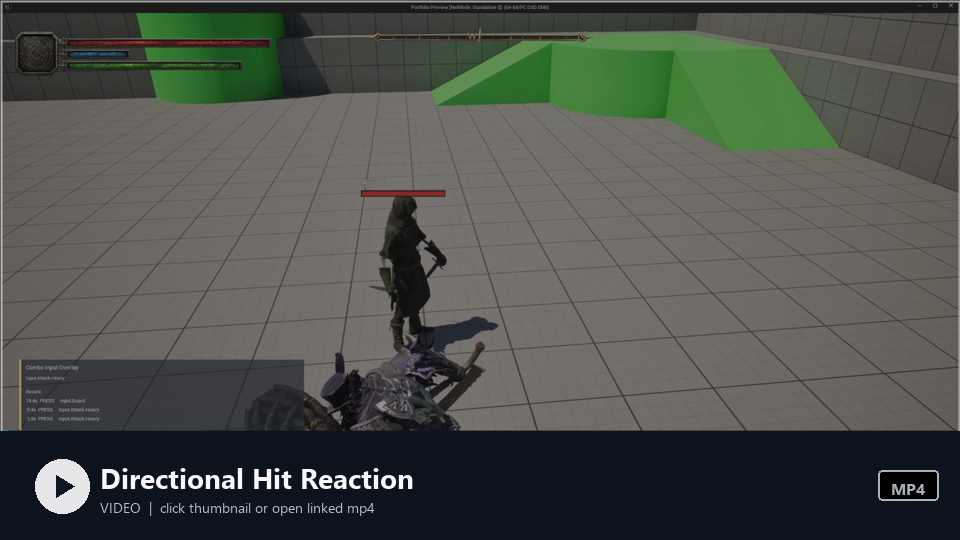](https://youtu.be/_Qe6dQ4yy6M)

**▶ 영상 보기:** [방향별 피격 리액션 MP4 열기](https://youtu.be/_Qe6dQ4yy6M)

### 3-5. 이상상태 계층

7종의 이상상태를 3단 상속으로 구현했습니다.

```
UPTGameplayAbility_HitReactionBase
  └── UPTGameplayAbility_AbnormalBase
      ├── AbnormalLightStagger   — 미세 밀림
      ├── AbnormalStagger        — 워프 + 경직
      ├── AbnormalHeavyStagger   — 큰 워프 + 긴 경직
      ├── AbnormalGroggy         — 2페이즈 (기절 → 기상)
      ├── AbnormalKnockdown      — 넘어짐 + 기상 (슈퍼아머)
      ├── AbnormalParryBroken    — 패링 실패 경직
      └── AbnormalStanceBroken   — 체간 파괴 → 처형 가능
```

Groggy는 **2페이즈** 구조입니다. 기절 몽타주 재생 후 자동으로 기상 몽타주로 전환됩니다. 기절 중에는 추가 공격에 취약합니다. Knockdown은 기상 중 슈퍼아머가 적용되어 무한 연속 넉다운을 방지합니다. Knockdown 어빌리티는 `UPhysicalAnimationComponent`와 결합되어, 넘어지는 순간의 충격은 물리로 표현하고 기상 페이즈는 몽타주가 주도하도록 부분 물리/애니메이션 블렌딩을 사용합니다.

### 3-6. 가드 / 패링 / 처형

**가드**: 스태미나 기반 방어입니다. 가드 중 피격 시 스태미나가 소모되고, 0이 되면 가드 브레이크가 발생합니다. 가드 임팩트는 Weak/Strong/Broken 3단계로 세분화되어 있습니다.

**패링**: 가드 중 특정 타이밍 윈도우에 패링 입력을 넣으면 발동합니다. 성공 시 공격자에게 ParryBroken 이상상태를 부여하고, 리포스트(처형) 기회가 열립니다.

**가드 카운터(Guard Counter)**: 가드 임팩트 직후 짧은 윈도우 동안만 사용할 수 있는 강공입니다. `PTGameplayAbility_GuardCounter`가 `PTCombatGameplayAbility`를 그대로 상속해 일반 콤보와 같은 전투 파이프라인을 타지만, 실행 트리거는 가드 임팩트 어빌리티가 부여한 윈도우 태그가 살아있을 때만 열립니다. 일반 콤보와 동일한 Feature 컴포지션(데미지/체간/모션워핑 등)을 그대로 쓰면서, "막아낸 직후의 반격"이라는 메커닉을 코드 추가 없이 데이터/태그 조합만으로 구현했습니다.

> [첨부-C4] **플레이 영상**: 적의 공격을 가드로 받아낸 직후, 가드 카운터 윈도우가 열린 동안 강공 입력으로 반격이 발동하는 흐름입니다. 윈도우가 닫히면 일반 공격으로 전환되어, 타이밍에 따라 같은 입력이 다른 어빌리티로 분기되는 점을 보여줍니다.

[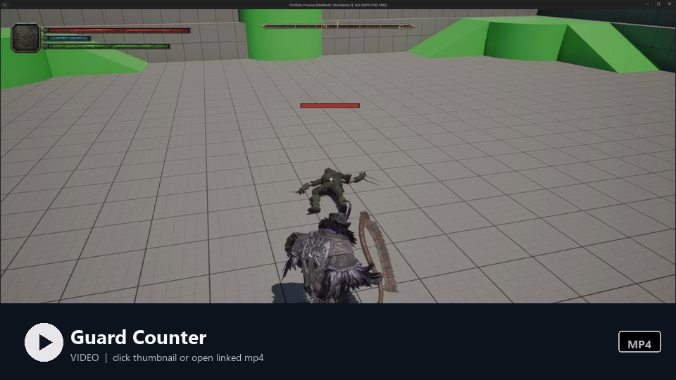](https://youtu.be/T_VSHttePxY)

**▶ 영상 보기:** [가드 카운터 MP4 열기](https://youtu.be/T_VSHttePxY)

**처형(Riposte/Backstab)**: 공격자와 피해자가 **각각 독립된 어빌리티**를 실행하는 페어드 시스템입니다.

```
[공격자: Riposte Ability]     [피해자: RiposteVictim Ability]
  ├─ 다단계 몽타주 체이닝    ←Signal→  대응 몽타주 재생
  ├─ ExecutionHit 이벤트 발생  ──────→  대량 데미지 수신
  └─ 처형 완료                         처형 완료 or 사망
```

피해자 어빌리티가 독립적이기 때문에, 피해자의 면역/방어 체계가 정상적으로 동작합니다. 슈퍼아머로 처형을 탈출하는 것도 가능합니다.

> [첨부-C9] **플레이 영상**: 가드 중 연속 피격으로 스태미나가 0이 되면 가드 브레이크가 발생하고, 그로기 리액션으로 전환되는 흐름을 보여줍니다.

[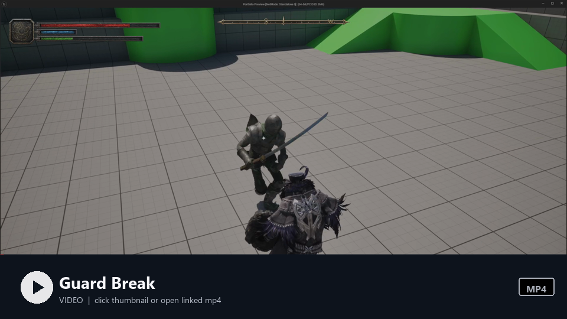](https://youtu.be/6tVipBkZYTU)

**▶ 영상 보기:** [가드 브레이크 MP4 열기](https://youtu.be/6tVipBkZYTU)

> [첨부-C5] **플레이 영상**: 패링 → 리포스트 연계 장면. 패링 성공 시 히트스톱이 걸리고, 이어서 처형 몽타주가 진행되는 과정입니다.

[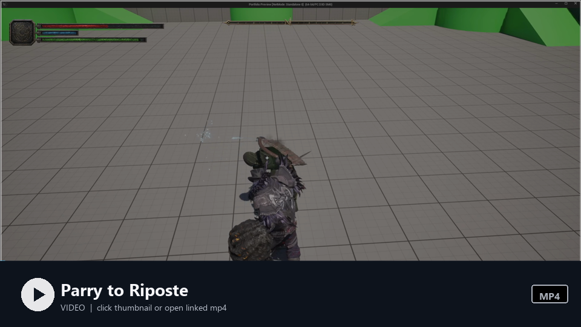](https://youtu.be/F44evDYUpOg)

**▶ 영상 보기:** [패링-리포스트 MP4 열기](https://youtu.be/F44evDYUpOg)

> [첨부-C6] **플레이 영상**: 후방 접근 후 위치/방향 조건을 만족하면 백스탭 처형으로 진입하는 흐름입니다. 리포스트와 마찬가지로 공격자/피해자 어빌리티가 함께 동작하는 페어드 처형 구조를 보여줍니다.

[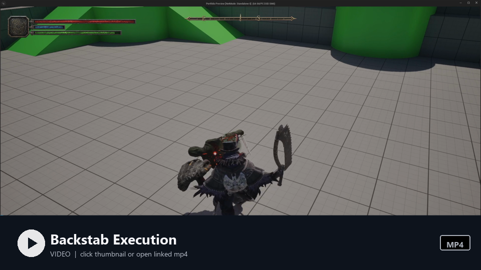](https://youtu.be/e3u7Da7w9-E)

**▶ 영상 보기:** [백스탭 처형 MP4 열기](https://youtu.be/e3u7Da7w9-E)

### 3-7. 체간(Stance) 시스템

엘든링의 Stance 메커닉을 구현했습니다. 몬스터에게 `Stance` 어트리뷰트가 있고, 플레이어의 공격마다 `StanceDamage` Feature에 설정된 만큼 감소합니다. 0에 도달하면 `AbnormalStanceBroken`이 발동하고, 처형 기회가 열립니다.

Stance는 마지막 피격 후 `StanceRecoveryDelay`(기본 5초) 이후에 자동 회복을 시작합니다. 지속적으로 공격하면 회복을 막을 수 있고, 공격을 멈추면 서서히 회복됩니다.

> [첨부-C7] **플레이 영상**: 체간 시스템 풀 사이클. Stance 수치 감소 → 지연 회복 → 재공격 후 브레이크/그로기 전환 흐름이 보이도록 Attribute 영역을 확대 강조했습니다.

[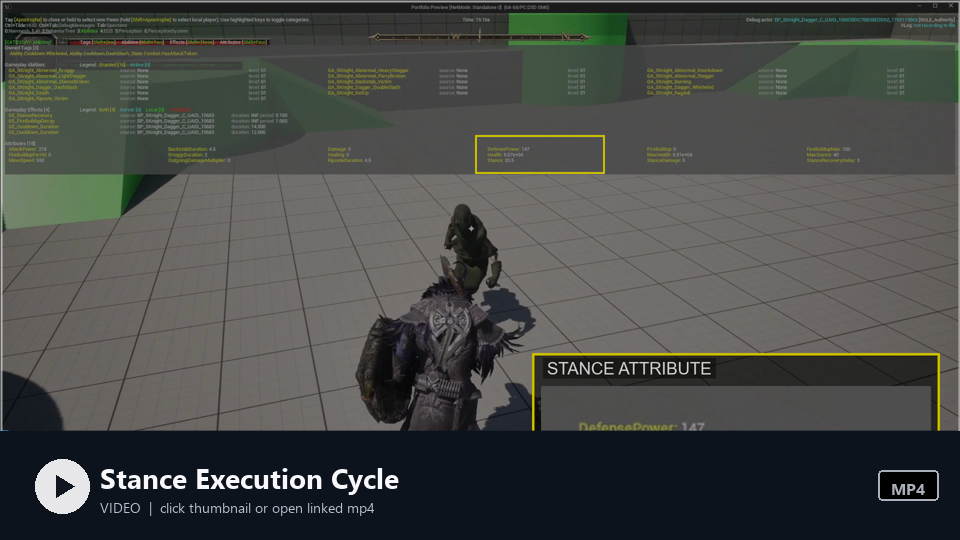](https://youtu.be/23tsOPDERtc)

**▶ 영상 보기:** [체간-처형 사이클 MP4 열기](https://youtu.be/23tsOPDERtc)

### 3-8. HitStop

`PTHitStopSubsystem`이 히트 시 시간 정지 효과를 줍니다. Custom 모드(공격자/피격자 `CustomTimeDilation` 개별 적용)와 Global 모드(월드 전체 정지)를 지원하고, `FInterpTo` 기반으로 부드럽게 회복됩니다.

> [첨부-C8] **비교 영상**: 같은 타격을 HitStop 미적용/적용 상태로 각각 촬영했습니다. 미적용 영상은 타격 후 모션이 바로 이어지고, 적용 영상은 타격 순간 공격자/피격자의 시간이 짧게 멈추며 충격이 강조되는 것을 보여줍니다.

[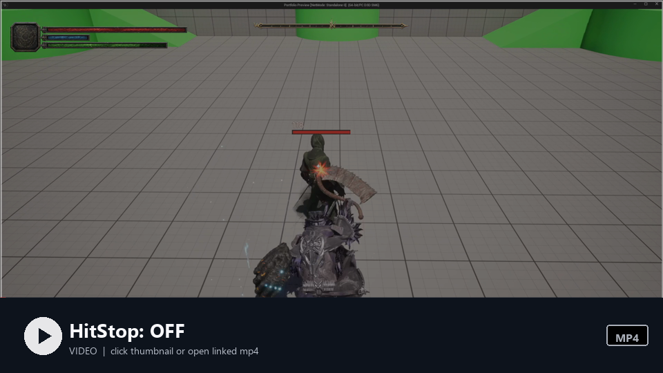](https://youtu.be/nTzh9Qck-5w)

**▶ 영상 보기:** [HitStop 미적용 MP4 열기](https://youtu.be/nTzh9Qck-5w)

[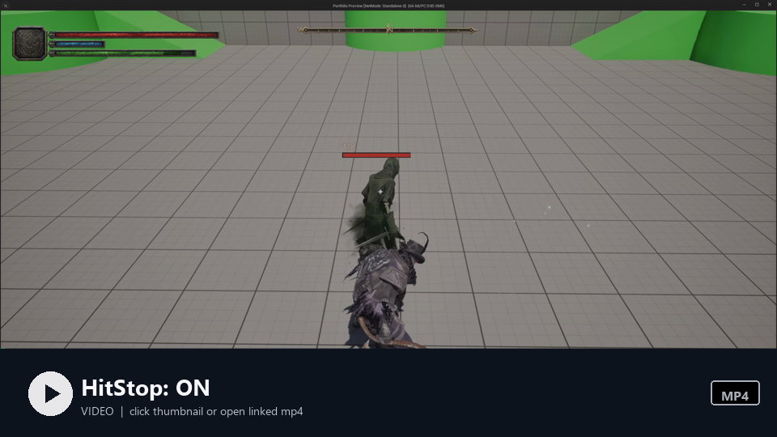](https://youtu.be/P5eJ2IKTl3Q)

**▶ 영상 보기:** [HitStop 적용 MP4 열기](https://youtu.be/P5eJ2IKTl3Q)

### 파이프라인 전체 흐름 요약

```
무기 스윙
 → PostPhysics 스웹 트레이스 (보간 + 이중 판정)
   → 히트 판정 성공
     → GameplayEffect 적용
       → DamageCalculation (비율 기반 방어 스케일링)
       → GE Component: HitReaction 라우팅
         → 이상상태 어빌리티 활성화
          → GameplayCue: 표면 기반 VFX/SFX
          → HitStop: 시간 정지 피드백
```

---

## 4. 애니메이션/워핑 — 전투 타이밍과 이동 보정

전투 어빌리티가 “무엇을 실행할지”를 결정한다면, 애니메이션/워핑 시스템은 그 실행이 화면에서 자연스럽게 보이도록 책임집니다. 이 섹션은 공격 중 위치 보정, 플레이어/몬스터 애니메이션 방식 분리, AnimNotify 기반 전투 윈도우 제어를 다룹니다.

### 모션 워핑 & 타겟 트래킹

전투 중 위치 보정은 엔진의 `URootMotionModifier_SkewWarp`를 기반으로 한 `PTRootMotionModifier_CombatWarp`로 처리합니다. 커스텀 클래스는 워프 타깃 이름(`CombatWarpingName`), 회전/이동 워프 옵션, `MaxSpeedClampRatio = 3.0` 같은 전투용 기본값을 한 곳에 모아두는 역할을 하고, 앵커 종류(TargetFront/TargetBack/Relative) 선택과 보간 자체는 SkewWarp의 검증된 구현을 그대로 활용했습니다. 그 위에 `WarpTracking` 어빌리티 태스크가 매 프레임 워프 포인트를 재계산해 이동하는 타겟까지 추적하도록 보강했고, `MaxSpeedClampRatio`로 비현실적 슬라이딩을 방지합니다.

> [첨부-D1] **플레이 영상**: 같은 공격 애니메이션을 두 번 재생해 비교합니다. 첫 번째 공격은 모션 워핑 미적용 상태라 거리/방향 오차가 남고, 두 번째 공격은 모션 워핑 적용으로 타겟까지의 거리와 방향이 보정됩니다.

[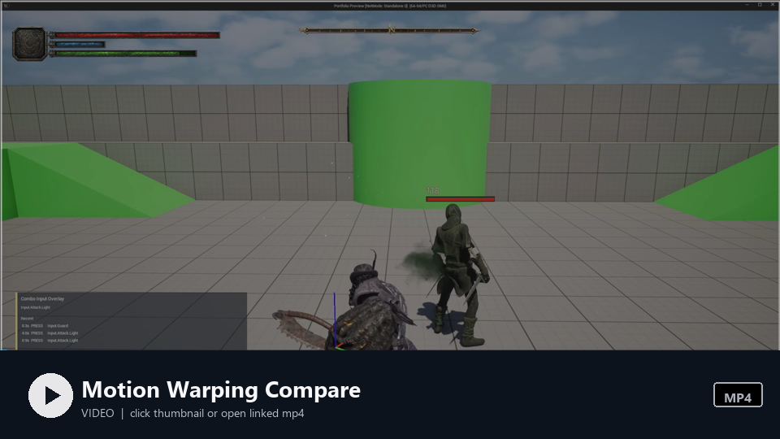](https://youtu.be/xE5qDUOoNdU)

**▶ 영상 보기:** [모션 워핑 적용 전/후 MP4 열기](https://youtu.be/xE5qDUOoNdU)

### 애니메이션 시스템 — 플레이어와 몬스터의 이원화

#### 왜 다른 방식을 선택했는가

플레이어와 몬스터는 이동 특성이 다릅니다. 이 차이를 무시하고 하나의 방식으로 통일하면, 한쪽의 애니메이션 품질이나 구현 단순성이 낮아지기 쉽습니다.

| | 플레이어 | 몬스터 |
|:---|:---|:---|
| **이동 특성** | 8방향, 락온/프리 전환, 급격한 피벗 | 접근/후퇴/선회, 비교적 단순 |
| **상태 전환 복잡도** | 이동 자체가 복잡 | 전투 상태(비전투/전투/가드/경계/떨림/제자리회전)가 복잡 |
| **핵심 과제** | 방향 전환 시 자연스러운 발 디딤 | AI 상태와 애니메이션의 정확한 동기화 |

**플레이어: 모션 매칭 (PoseSearch)**

전통 스테이트 머신으로 8방향 × 속도 × 피벗 × 정지를 처리하면 상태 조합이 급격히 늘어납니다. 모션 매칭은 0.4~0.5초 전방 궤적을 예측하고, PoseSearch 데이터베이스에서 가장 적합한 애니메이션을 자동 선택합니다.

여기서 `MotionMatchingProxyComponent`가 **GAS 태그 변화를 감지**해 모션 매칭 상태 전환에 필요한 태그 정보를 갱신합니다. 예를 들어 락온 태그가 붙으면 락온 이동 상태로, 해제되면 프리 이동 상태로 해석할 수 있도록 상태 태그를 제공했습니다. 이 전환이 GAS와 연동되기 때문에, 어빌리티 시스템이 부여하는 상태 태그를 애니메이션 선택 기준으로 사용할 수 있습니다.

상태 그룹마다 `PriorityTags` 배열을 두고, 배열 순서대로 가장 먼저 매칭되는 태그를 채택하는 방식을 썼습니다. 락온 + 슬로우 + 무장 같은 태그가 동시에 활성화되어도 우선순위 순서대로 단 하나의 상태가 확정되기 때문에, 상태 충돌을 if/else로 처리하지 않고 데이터(`UPTMotionMatchingConfig`)만으로 결정 규칙을 표현할 수 있었습니다.

추가로 피벗 감지(가속 방향과 속도 방향의 30° 이상 차이), 이동 시작 감지(미래 속도가 현재 + 100u 이상), 그리고 `PTCharacterTrajectoryComponent`의 다단계 궤적 보정(공중 상태 보정 → 벽 충돌 보정)까지 구현해서 모션 매칭의 약점(벽 앞에서 달리는 모션, 정지 시 미끄러짐, 점프 직후 잘못된 미래 위치)을 보완했습니다. 벽 충돌 보정은 실제 속도가 최대 속도의 일정 비율 이하로 떨어지거나, 입력 방향과 실제 이동 방향의 내적이 임계치 이하가 되면 활성화되어, 입력 의도 방향으로 미래 궤적을 재계산합니다.

**몬스터: AnimProxy 이벤트 기반 스테이트 머신**

몬스터는 이동보다 **전투 상태 동기화**가 핵심입니다. AI가 "전투 돌입", "가드 시작", "경계 상태" 같은 결정을 내리면, 이것이 정확히 애니메이션에 반영되어야 합니다.

`AnimationProxy` 시스템으로 이를 해결했습니다. AI/게임 로직은 태그 기반 이벤트를 발행하고, MonsterAnimInstance는 이를 구독합니다:

```
AnimProxy::Combat     → 비전투/전투 스테이트 전환
AnimProxy::Guard      → 가드 스테이트 전환
AnimProxy::Tremble    → 피격 떨림 (알파 감쇄)
AnimProxy::Suspicious → 경계 블렌딩 (보간)
AnimProxy::TurnInPlace → 제자리 회전 (Yaw 회전 속도를 가짜 이동속도로 매핑)
AnimProxy::HitImpact  → 피격 임펄스 (베이스 AnimInstance에서 처리되는 공통 이벤트)
```

마지막 `HitImpact`는 플레이어/몬스터 양쪽이 공유하는 공통 이벤트라 베이스 `PTCharacterAnimInstance`에 구독을 두고, 나머지는 `PTMonsterAnimInstance`에서 구독합니다. "공통/특화 분리"가 페이로드 단에서도 명확하게 갈리도록 한 구조입니다.

몬스터에 모션 매칭을 쓰지 않은 이유는, 몬스터의 이동 패턴은 스테이트 머신으로 충분히 커버되고, 모션 매칭의 궤적 예측은 AI 경로 변경이 잦은 상황에서 오히려 부자연스러운 결과를 만들기 때문입니다.

**게임 로직 ↔ AnimInstance 구체 클래스 의존 최소화**

플레이어와 몬스터 양쪽 모두에 적용되는 설계 원칙이 있습니다. 일반적인 UE 프로젝트에서는 AnimInstance가 캐릭터를 직접 캐스팅해서 변수를 읽습니다:

```cpp
// 일반적인 직접 참조 방식
void UMyAnimInstance::NativeUpdateAnimation(float DeltaSeconds)
{
    AMyCharacter* Character = Cast<AMyCharacter>(TryGetPawnOwner());
    bIsInCombat = Character->bIsInCombat;  // AnimInstance가 게임 로직 클래스에 강결합
}
```

이렇게 하면 캐릭터 클래스 구조가 바뀔 때마다 AnimInstance가 깨지고, 다른 캐릭터 타입에 AnimBP를 재사용할 수 없습니다.

이 프로젝트에서는 `AnimationProxyComponent`가 **이벤트 버스** 역할을 합니다:

```
[게임 로직]                              [AnimInstance]
AI가 전투 돌입 결정                       NativeInitializeAnimation()에서
 → SendAnimationProxyEvent(              RegisterAnimationProxyEvent(
     "AnimProxy::Combat",                    "AnimProxy::Combat",
     FPTCombatStatePayload{true})            OnCombatStateChanged)
                  │                                    │
                  └──── AnimationProxyComponent ───────┘
                         (태그 → 델리게이트 맵)
```

게임 로직은 `IPTAnimationProxyProvider` 인터페이스를 통해 이벤트를 발행하고, AnimInstance는 같은 인터페이스를 통해 구독합니다. 양쪽이 서로의 구체 클래스를 알지 못합니다. 데이터는 `FInstancedStruct` 페이로드로 전달되기 때문에, AnimInstance가 게임 로직의 구체 클래스를 include할 필요가 없습니다.

페이로드는 `FPTAnimationProxyPayload`를 베이스로 두고 이벤트별 파생 구조체(`FPTCombatStatePayload`, `FPTHitImpactPayload`, `FPTTremblePayload`, `FPTSuspiciousPayload`, `FPTTurnInPlacePayload`, `FPTGuardPayload`)로 분기됩니다. 베이스가 USTRUCT라 `FInstancedStruct` 안에 안전하게 담기고, 받는 쪽에서는 이벤트 태그로 파생 타입을 확정하므로 별도 RTTI 없이도 타입 안전한 페이로드 다형성이 가능합니다. 인자 이름/순서 변경에 약한 BlueprintNativeEvent 대신 구조체로 전달하는 결정도 이 디커플링을 유지하기 위한 선택입니다.

이 디커플링 덕분에 `PTCharacterAnimInstance`(베이스)가 Player/Monster 양쪽의 공통 로직(이동 속도, 방향, HitImpact)을 처리하고, 파생 클래스는 각자의 특화 이벤트만 추가로 구독합니다.

> [첨부-D2] **에디터 스크린샷**: 몽타주 에디터의 AnimNotify 트랙. WindowCombo, WindowCancel, WindowBranch, CommitStamina 등 커스텀 Notify가 타임라인에 배치되어 전투 윈도우를 데이터로 제어하는 모습을 보여줍니다.
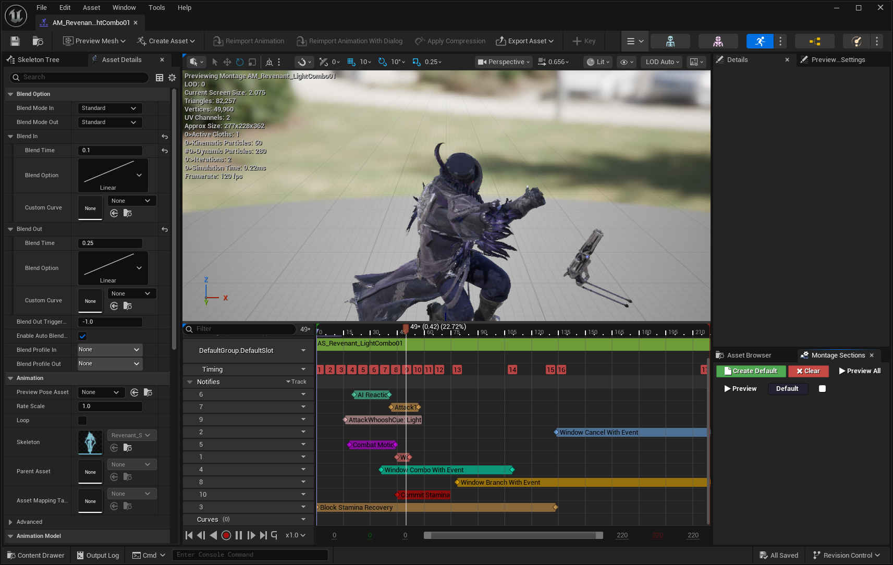

> [첨부-D2b] **에디터 스크린샷 비교**: 플레이어 ABP의 Motion Matching/PoseSearch 구성과 몬스터 ABP의 StateMachine/ControlRig 구성을 비교합니다. 같은 Base AnimInstance를 공유하면서도 캐릭터 유형에 따라 이동 처리 방식을 다르게 가져간 구조입니다.

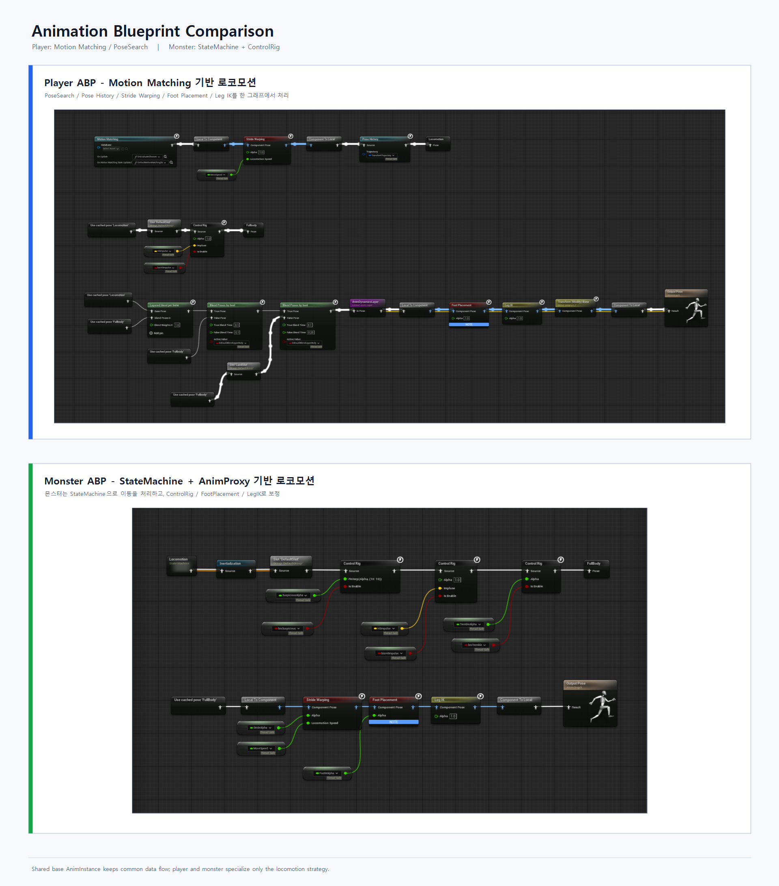

**6종의 커스텀 AnimNotify/State**(태그 부여, 게임플레이 이벤트 발행, 어택 트레일, GameplayCue, 루트모션 스케일, 워프 트래킹)로 전투 윈도우를 제어합니다. 콤보·캔슬·무적·트레이스·패링 같은 윈도우는 태그 기반 Notify로 통일해, 새 윈도우를 Notify 클래스 추가 없이 태그만으로 정의합니다. 이 Notify 시스템은 플레이어/몬스터 구분 없이 공통으로 동작합니다.

---

## 5. 보조 시스템 및 제작 파이프라인

아래 시스템들은 핵심 전투 루프를 직접 설명하는 장은 아니지만, 프로젝트가 실제 플레이 가능한 형태로 유지되도록 받쳐주는 구조입니다. 제출 문서에서는 본문보다 짧게 다루고, 면접 질문이 들어오면 세부 구현을 설명하는 보조 어필 포인트로 활용합니다.

### UI — SourceRegistry 자동 주입 + MVVM

#### 해결하려는 문제

ViewModel이 자신의 데이터 소스를 직접 찾는 구조(`GetOwningPlayer() → GetCharacter() → GetAbilitySystemComponent()`)를 쓰면, ViewModel이 게임 객체 계층에 강결합됩니다. Player의 구조가 바뀌면 UI 코드가 깨지고, 같은 ViewModel을 몬스터 HP바에 재사용하려면 분기 코드가 필요합니다.

#### 설계 결정 — 소스 자동 주입

이를 피하기 위해 세 가지 역할을 분리했습니다:

```
[게임 로직]                    [프레임워크]              [위젯]
Player가 스폰됨               UIManagerSubsystem       MonsterHPBar 위젯
 → SourceRegistry.SetSource   소스 변경 감지            RequiredSourceTags에
   (Tag: "UI.Source.Player",  → 매칭되는 위젯 탐색        "UI.Source.Monster" 선언
    Object: PlayerActor)      → OnSourceChanged() 호출
                               → ViewModel.SetSource()
                                 자동 주입
```

**게임 로직**은 `SourceRegistry.SetSource(태그, 객체)`로 소스를 등록합니다. **위젯**은 `RequiredSourceTags`에 필요한 태그를 선언합니다. 중간 매칭과 주입은 `UIManagerSubsystem`이 담당합니다.

ViewModel의 `SetSource()`는 `UObject*` 하나만 받기 때문에, 소스가 Player인지 Monster인지 Subsystem인지 구분하지 않습니다. 같은 ViewModel 클래스를 다른 컨텍스트에서 재사용할 수 있습니다.

위젯이 먼저 생성되고 소스가 나중에 등록되어도, 소스가 먼저 등록되고 위젯이 나중에 생성되어도 정상 동작합니다. `ApplySourcesToWidget()`이 위젯 생성 시 기존 소스를 확인하고, `HandleSourceChanged()`가 소스 변경 시 기존 위젯에 전파합니다.

UE5의 MVVM 플러그인과 FieldNotify를 기반으로, MVVM + FieldNotify + 태그 기반 SourceRegistry + 자동 주입 조합을 UI 전반에 적용했습니다.

8종 ViewModel(PlayerResources, MonsterHealthBar, Compass, LockOnReticle, InteractionPrompt, ItemAcquisition, PlayerQuickSlots, AbilitySystem)이 이 구조 위에서 각각 단일 책임으로 동작합니다. 그중 `PTAbilitySystemViewModel`은 ASC의 어트리뷰트/태그 변화를 FieldNotify로 노출하는 공용 ViewModel로, HP/스태미나/스탠스/락온 같은 위젯이 캐릭터 클래스를 직접 참조하지 않고도 동일한 소스에 바인딩되도록 합니다. 레이아웃은 DataAsset으로 정의하고, UIManagerSubsystem이 위젯 라이프사이클과 5단계 레이어 Z-오더링(HUD/Overlay/Screen/Modal/System)을 관리합니다.

| 단계 | 책임 |
|:---|:---|
| 게임 로직 | `SourceRegistry.SetSource(SourceTag, Object)`로 현재 소스 등록 |
| `PTUISourceRegistry` | `TMap<FGameplayTag, TWeakObjectPtr<UObject>>`로 소스 보관, 변경 이벤트 브로드캐스트 |
| `PTUIManagerSubsystem` | 관리 중인 위젯의 `RequiredSourceTags`와 변경된 SourceTag를 매칭 |
| 위젯/ViewModel | `OnSourceChanged()` → `ViewModel.SetSource()` → FieldNotify 바인딩 갱신 |

> [첨부-D3] **플레이 스크린샷**: 인게임 전투 중 HUD 전체 모습. 플레이어 HP/스태미나, 몬스터 HP 바, 퀵슬롯, 나침반이 실제 전투 화면 위에서 함께 동작하는 장면입니다.

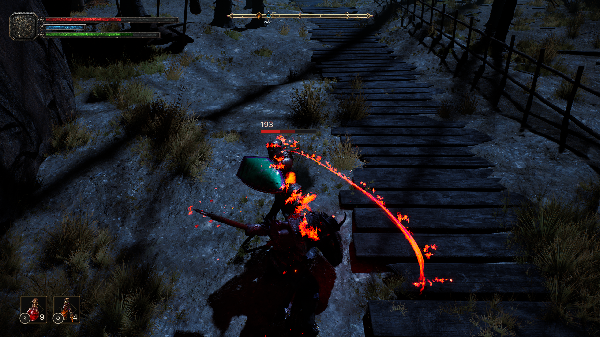

> [첨부-D3b] **다이어그램**: SourceRegistry 자동 주입 흐름을 시각적으로 정리한 다이어그램. 게임 로직 → Registry → Manager → Widget/ViewModel 흐름과, 소스가 먼저 등록된 경우/위젯이 먼저 생성된 경우를 함께 표시합니다.

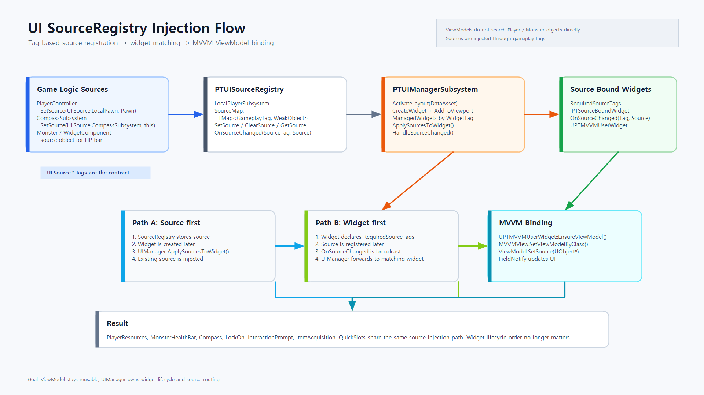

### 인풋 시스템

Enhanced Input + 0.4초 인풋 버퍼링으로 액션 게임의 반응성을 확보했습니다. ASC 태그 연동으로 상태 기반 입력 컨텍스트를 자동 전환합니다. InputGlyph 서브시스템이 Gamepad/KeyboardMouse 입력 타입을 감지하고 UI 글리프를 전환합니다.

> [첨부-D4] **비교 영상**: 인풋 버퍼링 미적용/적용 비교. 미적용 영상은 회피 중 선입력한 공격이 회피 종료 후 이어지지 않는 흐름을 보여주고, 적용 영상은 같은 타이밍의 선입력이 버퍼에 저장되어 회피 종료 시점에 공격으로 실행되는 흐름을 보여줍니다.

[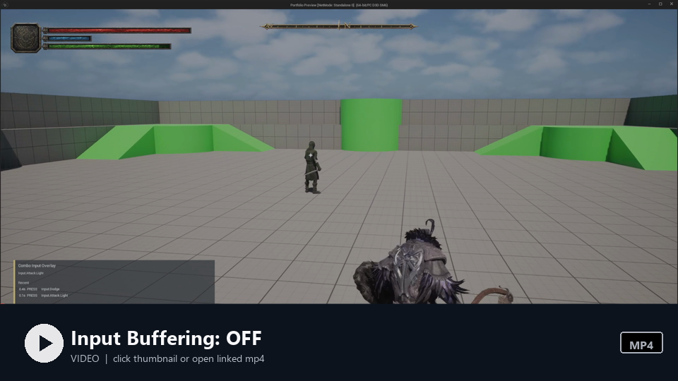](https://youtu.be/d_zGH9Jbbn4)

**[▶ 영상 보기: Input Buffering 미적용](https://youtu.be/d_zGH9Jbbn4)**

[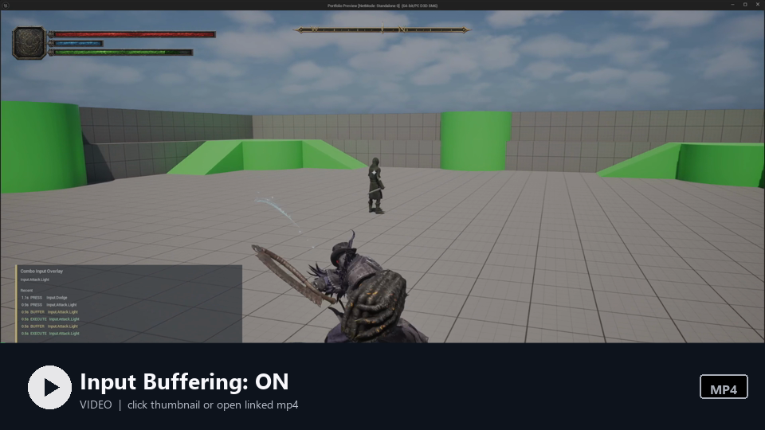](https://youtu.be/hhcBDmvO7DA)

**[▶ 영상 보기: Input Buffering 적용](https://youtu.be/hhcBDmvO7DA)**

### 에디터 커스터마이징 — 작업 파이프라인 설계

`PortfolioEditor` 모듈에 에디터 작업 효율을 위한 세 가지 커스터마이징을 구현했습니다.

**1. HitReaction 프로퍼티 자동완성**: HitReaction Feature에서 리액션 타입(Stagger, Knockdown 등)을 선택하면, 대응하는 GameplayEffect 클래스가 **자동으로 채워집니다.** 매핑 테이블은 `PTAbilityEditorSettings`에서 관리합니다. 수작업으로 GE 클래스를 찾아 넣을 때 생기는 실수를 줄이기 위해서입니다.

**2. GEApplication 기본값 자동 매핑**: Feature 타입(Damage, StaminaCost 등)을 선택하면 해당 타입에 맞는 기본 GE가 자동 설정됩니다.

**3. Root Motion Filter Modifier**: 애니메이션 임포트 시 루트 모션을 축별로 필터링하는 커스텀 애니메이션 모디파이어입니다. MovingAverage/LockToZero/LockToInitialFrame 3종 모드를 지원하고, X/Y/Z 축과 Roll/Pitch/Yaw를 개별 제어합니다.

> [첨부-D5] **에디터 영상**: HitReaction Feature에서 리액션 타입을 변경하면 대응하는 EffectClass가 자동으로 채워지는 흐름을 보여줍니다. 단일 스크린샷보다 실제 에디터 자동완성 과정을 확인하기 쉽습니다.

[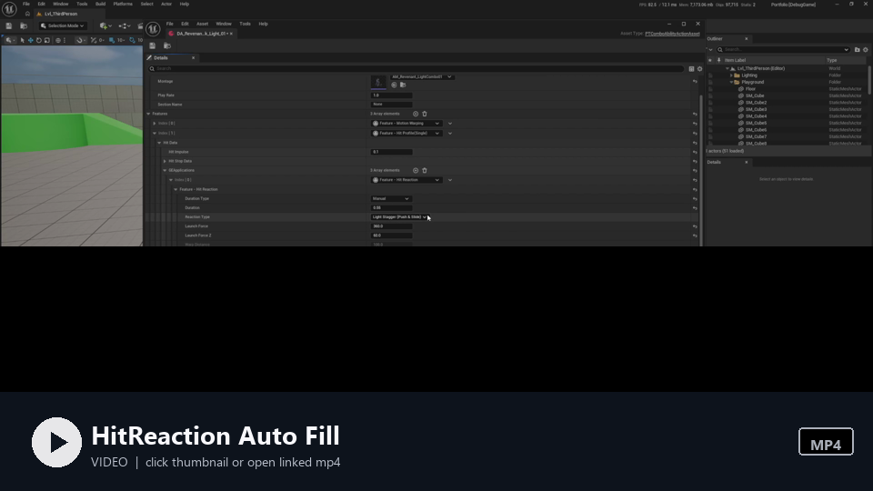](https://youtu.be/Afs2r-6sQgc)

**[▶ 영상 보기: HitReaction Feature 자동완성](https://youtu.be/Afs2r-6sQgc)**

### 레벨 전환 — Preload-Commit 패턴

`PTLevelTransitionSubsystem`이 비동기 레벨 로딩을 3단계로 처리합니다:

1. **Preload** — 백그라운드에서 레벨을 로드하되, Hidden 상태로 유지
2. **Commit** — 페이드 아웃 완료 신호를 받은 후, 이전 레벨 언로드 + 새 레벨 표시
3. **Complete** — 플레이어 텔레포트 후, **1프레임 딜레이**(`SetTimerForNextTick`)를 두고 완료 통보. 카메라 보간이 안정화되는 시간을 확보하기 위해서입니다.

`CurrentStreamingLevel`/`PendingStreamingLevel` 이중 관리로 레벨 전환 중 깜빡임을 방지하고, `FadeSubsystem`과 핸드셰이크로 로딩 → 페이드 → 전환이 정확한 순서로 진행됩니다.

### 사운드스케이프 / 상호작용 — 월드 신호와 서브시스템의 분리

게임플레이가 아니지만 플레이 경험을 좌우하는 두 영역도 같은 원칙(월드 오브젝트가 신호를 보내고, 서브시스템이 결정을 담당)으로 분리했습니다.

`PTSoundscapeVolume`은 레벨에 배치된 트리거 볼륨으로, 오버랩 시 `PTSoundscapeSubsystem`에 자신을 등록만 합니다. 어떤 BGM/Atmos를 어떤 페이드 시간으로 재생할지 결정하는 것은 서브시스템 쪽에서 우선순위와 활성 볼륨 스택을 보고 정합니다. RegionBGM, RegionAtmos, GlobalAtmos 3개 스트림을 분리 관리하기 때문에, 지역 BGM이 바뀌어도 분위기음(빗소리 등)은 끊기지 않게 페이드 처리할 수 있습니다.

`PTInteractionSubsystem`은 매 틱 후보 컴포넌트들에 대해 거리/각도 가중치로 점수를 매겨 최적의 상호작용 대상을 선택합니다(`AngleScoreWeight = 0.7`, `DistanceScoreWeight = 0.3`이 기본값). "가장 가까운 것"이 아니라 "지금 카메라가 향하는 방향에서 가장 자연스러운 것"이 선택되도록, 점수화를 통해 다목적 상호작용(아이템, 화톳불, NPC 대화)의 선택 직관을 일관되게 유지합니다. `IsTickable()`이 후보 존재 여부로 바뀌도록 해서 빈 월드에서는 틱이 돌지 않습니다.

### 서브시스템 아키텍처

World 서브시스템 7종, LocalPlayer 서브시스템 12종, GameInstance 서브시스템 1종으로 게임 시스템을 분산 관리합니다. 특히 `BonFireSubsystem`이 소울라이크 코어 루프(체크포인트 → 사망 → 리스폰 → 몬스터 리젠)를 담당합니다. 사운드스케이프, 나침반, HitStop, 아이템 드랍 등 각 서브시스템이 단일 책임을 가지고, `InitializeDependency<>()`로 초기화 순서를 보장합니다. 틱이 필요한 서브시스템은 `IsTickable()` 조건을 둬서 유휴 시 불필요한 틱을 줄였습니다.

### GameplayTag 중앙화 / 디버그 가시화

게임 전역에서 사용하는 태그는 `Ability`, `State`, `Event`, `Animation`, `Input`, `FX`, `GameplayCue`, `Noise`, `BonFire`, `UI`, `Common` 11개 카테고리 헤더에 `UE_DECLARE_GAMEPLAY_TAG_EXTERN`으로 모아두었습니다. 문자열 리터럴 대신 컴파일 타임에 검증되는 상수 핸들로만 태그를 사용하기 때문에, 태그 오타로 인한 런타임 무반응 버그가 원천적으로 차단됩니다.

또한 `PTCollisionDebug`, `PTExecutionDebugComponent`, `PTInputDebugOverlayComponent` 등 디버그 시각화는 `#if !UE_BUILD_SHIPPING`으로 격리해, 출하 빌드에는 코드 자체가 포함되지 않습니다. 트레이스 박스, 처형 판정 범위, 입력 버퍼 상태 같은 시스템 내부를 토글 하나로 화면 위에서 확인할 수 있어, 위에서 다룬 AttackTrace/Execution/InputBuffering 영상도 모두 이 가시화 위에서 촬영했습니다.

---

## 6. 아키텍처 전체상

전투 한 사이클은 입력/AI 판단에서 시작해 AbilitySet, ActionData, Feature 실행, 트레이스/워핑, 히트 파이프라인, UI 피드백, AI 반응 루프로 이어집니다. 앞선 섹션들이 개별 시스템의 책임을 설명했다면, 아래 다이어그램은 그 연결 관계를 한 장으로 정리한 것입니다.

> [첨부-E1] **전체 아키텍처 다이어그램**: Ability/Data/AI/Combat/UI 흐름을 하나로 묶어, 입력/AI 판단이 AbilitySet과 ActionData를 거쳐 전투 실행, 피드백, UI, AI 반응 루프로 이어지는 구조를 정리했습니다.
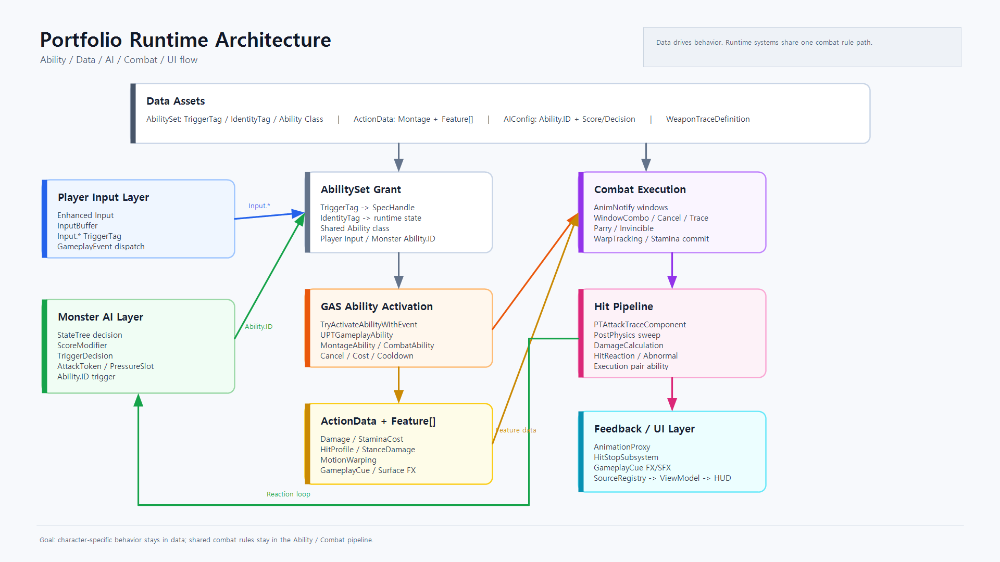

